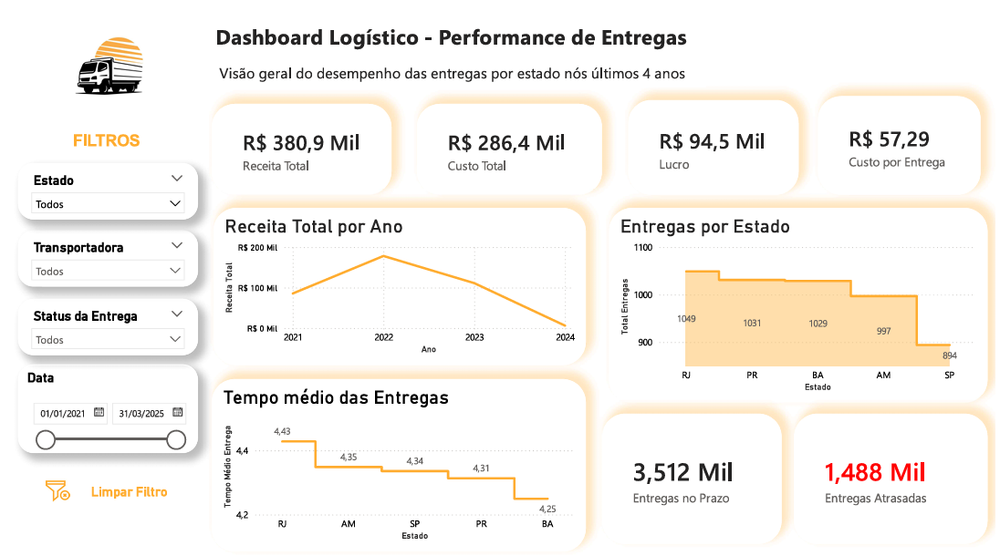

# 📊 Dashboard Transportadora - Power BI

Fala pessoal! 👋

Esse projeto eu desenvolvi como parte dos meus estudos em Power BI, com o objetivo de simular um cenário real de uma transportadora.

A ideia foi construir desde a base de dados até a visualização final, pensando em um contexto próximo do dia a dia de uma operação logística.

## 📷 Dashboard

## 🚚 Sobre o projeto

Simulei uma transportadora com aproximadamente 4 anos de operação, incluindo:

- Períodos de crescimento
- Momentos de queda
- Recuperação do negócio

Os dados não seguem um padrão fixo, justamente para deixar a análise mais realista.

## 📊 O que você vai encontrar

- Dashboard de performance de entregas
- Análise por estado
- Receita, custo e lucro
- Indicadores de prazo (no prazo vs atrasado)
- Tempo médio de entrega
- Custo por entrega

## 🧠 O que pratiquei aqui

- Modelagem de dados (Fato x Dimensão)
- Criação de medidas em DAX
- Construção de KPIs
- Organização visual de dashboard
- Boas práticas de formatação

## 🛠️ Ferramentas

- Power BI
- Excel

